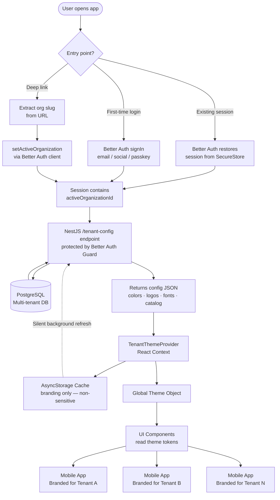
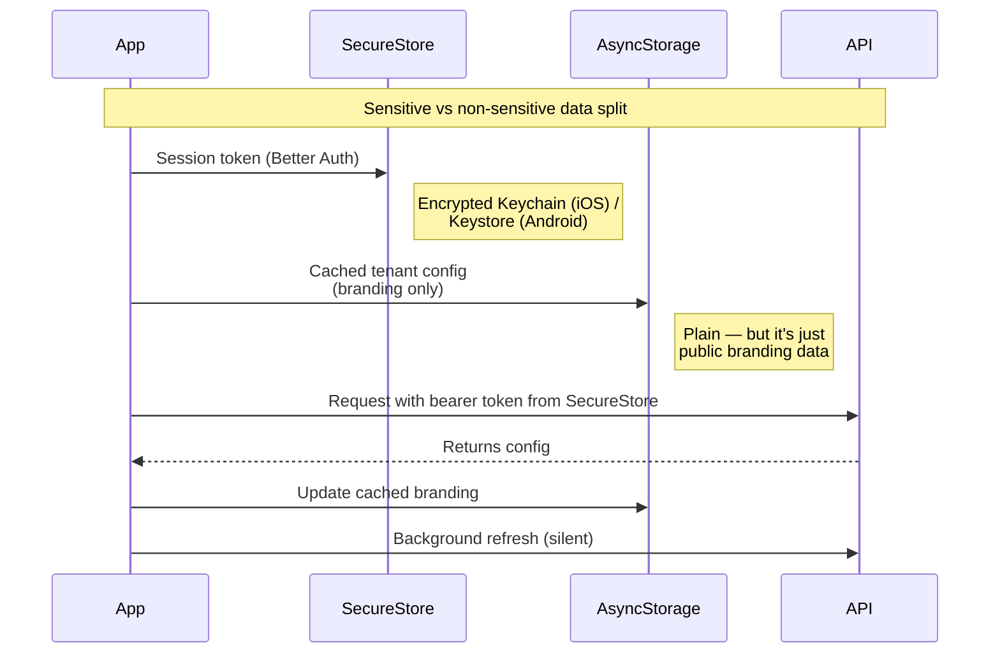
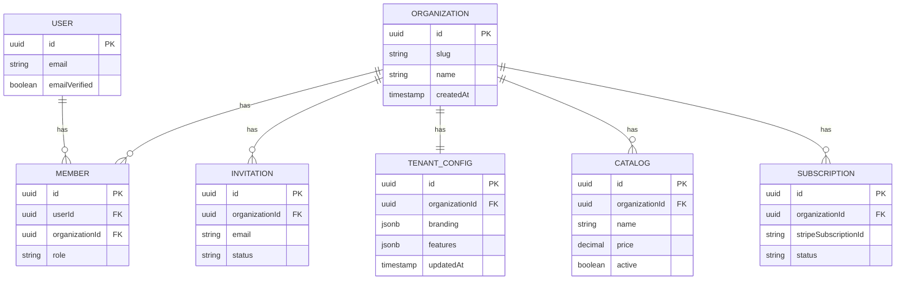

# Got it! Multi-Tenant Mobile App — Architecture Answer

> **Note:** This architecture is based only on the information available in the job posting. Some decisions will likely change once I'm hired and have full context — actual user flows, business constraints, existing tech preferences, scale targets, and edge cases that aren't visible from the outside. Treat this as a starting point for discussion, not a final blueprint.

## The Question
**How would you technically handle the multi-tenant mobile app branding switch?**

---

## Architecture Overview



---

## Step-by-Step Breakdown

### 1. Backend Framework — NestJS

For the backend, I'd use **NestJS** rather than plain Express or Fastify. The reasoning, in order of importance:

- **Maintainability** — opinionated module/controller/service structure means the codebase stays clean as it grows. There's exactly one right way to do each thing, which matters when an MVP unexpectedly becomes the production system.
- **Testability** — built-in dependency injection makes services trivially mockable. Once real customers are using it and you can't ship broken code, this pays for itself.
- **Team scalability** — when the next hire joins, the structure is self-documenting. No tribal knowledge about "how we organize routes here."
- **TypeScript-first with decorators** — `@Controller()`, `@Injectable()`, `@UseGuards()`. Patterns are explicit and visible, not buried in middleware chains.
- **CLI scaffolding** — `nest g module billing` generates the folder structure with sensible defaults.
- **Bonus: AI tooling works well with it** — because the structure is so predictable, tools like Claude Code or Cursor produce consistent output. With Express/Fastify, the same request produces wildly different code depending on the codebase's conventions. Real velocity win for a solo MVP build, though not the primary reason to pick the framework.

```typescript
// Example: a clean NestJS module structure
src/
  tenant-config/
    tenant-config.module.ts
    tenant-config.controller.ts
    tenant-config.service.ts
    dto/tenant-config.dto.ts
  organizations/
    ...
  catalog/
    ...
  payments/
    ...
```

---

### 2. Authentication Layer — Better Auth

We use **Better Auth** with its **organization plugin**. This gives us:

- Multi-tenant primitives out of the box (`organization`, `member`, `invitation` tables auto-generated via `npx @better-auth/cli migrate`)
- Native Expo / React Native support with `useSession` hook
- Bearer-token-based sessions for mobile, cookie-based for the web dashboard — handled by the same auth instance
- Social sign-in (Apple, Google) with native ID token flow — required for App Store approval
- Built-in invitation flow for B2B onboarding (business owners invite their staff)
- The active organization is part of the session — no need to manually pass tenant IDs around

```typescript
// src/auth/auth.config.ts
import { betterAuth } from "better-auth";
import { organization } from "better-auth/plugins";
import { expo } from "@better-auth/expo";

export const auth = betterAuth({
  database: pgPool,
  plugins: [
    organization({
      allowUserToCreateOrganization: false, // only via admin dashboard
    }),
    expo(),
  ],
  emailAndPassword: { enabled: true },
  socialProviders: { apple: {...}, google: {...} },
});
```

Better Auth handles JWT signing, refresh rotation, PKCE for mobile, session management, and the JWKS endpoint — all things that are easy to get subtly wrong and expensive to debug. For an MVP where we need to move fast without compromising security, this is exactly the right level of abstraction.

Worth noting: Better Auth is newer than alternatives like Clerk, Auth0, or Firebase Auth. I think it's the right pick here because the organization plugin maps cleanly to our multi-tenant model and there's no vendor lock-in — but it's a deliberate bet on a younger library. Happy to discuss if you'd prefer something more mature.

I'd wire it into NestJS via a `@UseGuards(BetterAuthGuard)` decorator on protected routes, with the guard extracting the session and attaching `activeOrganizationId` to the request context.

---

### 3. Tenant Identity Resolution (Entry Point)

The very first thing the app does before any UI renders is figure out **which tenant this session belongs to**. Three paths:

- **Deep link**: User taps `app://acme-corp/checkout` → extract the `acme-corp` slug → call `authClient.organization.setActive({ organizationSlug: "acme-corp" })`
- **Existing session**: User already signed in → Better Auth restores the session from `SecureStore`, which includes `activeOrganizationId`
- **First-time login**: User authenticates → Better Auth issues a session → if they belong to one org, that becomes active automatically; if multiple, show a picker

The active organization ID is now available everywhere via `useSession()`.

```typescript
const { data: session } = authClient.useSession();
const tenantId = session?.session.activeOrganizationId;
```

---

### 4. The `/tenant-config` Endpoint (NestJS)

A clean NestJS controller protected by a Better Auth guard. No manual JWT validation needed — the guard handles it:

```typescript
// src/tenant-config/tenant-config.controller.ts
@Controller('tenant-config')
@UseGuards(BetterAuthGuard)
export class TenantConfigController {
  constructor(private readonly tenantConfigService: TenantConfigService) {}

  @Get()
  async getConfig(@CurrentOrg() orgId: string) {
    return this.tenantConfigService.getByOrganizationId(orgId);
  }
}
```

```typescript
// src/tenant-config/tenant-config.service.ts
@Injectable()
export class TenantConfigService {
  constructor(private readonly prisma: PrismaService) {}

  async getByOrganizationId(orgId: string) {
    return this.prisma.tenantConfig.findUnique({
      where: { organizationId: orgId },
    });
  }
}
```

Returns a single config object — one round trip. Branding + feature flags only; the actual catalog has its own paginated endpoint (covered in section 7) to keep this response small and cacheable:

```json
{
  "organizationId": "acme-corp",
  "updatedAt": "2026-06-01T12:00:00Z",
  "branding": {
    "primaryColor": "#FF6B35",
    "secondaryColor": "#004E89",
    "logoUrl": "https://cdn.example.com/acme/logo.png",
    "fontFamily": "Poppins"
  },
  "features": {
    "stripeConnect": true,
    "klarna": false
  }
}
```

The `updatedAt` field doubles as a cache version — the client compares it against its cached value and only re-renders if newer. Combined with HTTP ETag headers, this makes background refreshes essentially free when nothing has changed.

The `@CurrentOrg()` custom decorator extracts `activeOrganizationId` from the request, set there by the `BetterAuthGuard`. This pattern keeps controllers clean and intent obvious.

**Server-side validation matters:** before persisting any tenant config update from the dashboard, the backend validates branding values — contrast ratios meet WCAG AA, hex colors are well-formed, logo URLs resolve to images of expected dimensions. A business owner uploading `primaryColor: "#FFFFFF"` on a white background would otherwise break the entire app for their customers.

---

### 5. TenantThemeProvider (React Native Side)

The entire app is wrapped in a `TenantThemeProvider` — a React Context that:

1. Receives the config JSON
2. Builds a **theme object** from it (colors, fonts, sizes)
3. Injects it into every child component via context

```typescript
// Every component does this — no hardcoded values anywhere
const theme = useTenantTheme();

<Text style={{ color: theme.primaryColor }}>Hello</Text>
<Image source={{ uri: theme.logoUrl }} />
```

Switching tenants = updating context. **Zero rebuilds. Zero redeployments.**

---

### 6. Storage Strategy — Two Layers, Two Purposes

This is an important security detail people often get wrong:



- **`SecureStore` / Keychain** → session tokens, refresh tokens (Better Auth handles this automatically via the `expo` plugin)
- **`AsyncStorage`** → branding cache only. It's fine here because branding (colors, logo URLs) isn't sensitive — it's the same data the public sees when they open the app.

**Never put auth tokens in AsyncStorage.** It's unencrypted and accessible to any process with file system access on a jailbroken device.

---

### 7. Catalog — Lazy Loading via React Query

Product catalogs can have hundreds of items. Instead of loading everything at once:

```typescript
const { data, fetchNextPage } = useInfiniteQuery({
  queryKey: ['catalog', tenantId],
  queryFn: ({ pageParam = 1 }) =>
    fetchCatalog(tenantId, pageParam),
  getNextPageParam: (lastPage) => lastPage.nextPage,
});
```

- Paginated API calls — load 20 items at a time
- Cached per tenant — switching back to a previous tenant is instant
- Prefetches next page in background while user scrolls

On the NestJS side, this is a paginated endpoint using Prisma's cursor-based pagination — clean, fast, and indexable.

---

### 8. Database — Multi-Tenant Schema

Better Auth's organization plugin auto-generates the `organization`, `member`, and `invitation` tables. We extend these with our own tables for tenant-specific data:



All app data is scoped by `organizationId`. **PostgreSQL row-level security (RLS)** policies ensure no tenant can ever see another's data — even if a query has a bug, the DB itself blocks cross-tenant reads.

```sql
-- Example RLS policy
CREATE POLICY catalog_tenant_isolation ON catalog
USING (organization_id = current_setting('app.current_tenant')::uuid);
```

The current tenant is set on each connection via a NestJS interceptor → DB session variable. Defense in depth.

**One operational gotcha with RLS + connection pooling:** the `app.current_tenant` session variable persists on the connection after the request finishes. If the next request checks out the same connection and forgets to set it, it can leak the previous tenant's data. The fix is to always set the variable at the start of each request *and* reset it on release (via a Prisma middleware or NestJS interceptor's `finally` block). This is the kind of subtle bug that doesn't show up in testing — easy to verify with a load test that mixes tenant requests across the pool.

---

## Why This Scales

| Concern | Solution |
|---|---|
| Adding a new tenant | Insert a row in `organization` — no code changes |
| Tenant updates branding | Dashboard writes to `tenant_config` → next background refresh picks it up |
| 1,000 tenants | Same codebase, same app binary — context handles the rest |
| Offline support | Cached branding renders the app instantly on launch; full offline functionality (checkout, etc.) requires explicit per-flow handling |
| Performance | React Query deduplicates requests, lazy loads catalog |
| Security | Better Auth + PostgreSQL RLS = belt and suspenders |
| Onboarding new staff per tenant | Better Auth's built-in invitation flow with email |
| Adding new features | NestJS module pattern — `nest g module` and you're scaffolded |

---

## Trade-offs I'd Flag to Lukas

- **Row-level security adds operational complexity.** For an MVP we could skip RLS and rely on app-layer filtering only — but I'd add it before serious customer data lands.
- **The deep link → setActive flow needs careful UX** — if a user has multiple orgs and lands on a deep link for a different one than their current active, we need to confirm or auto-switch. I'd make this product-driven.
